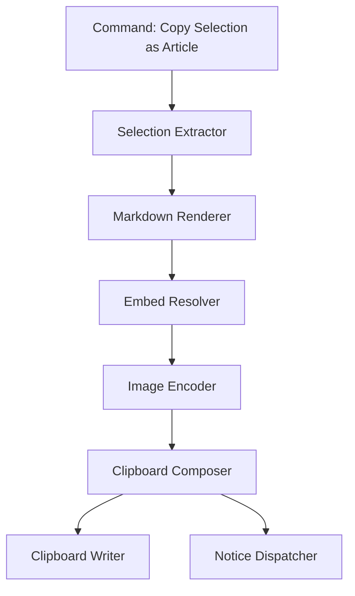

# Design Document

## Overview

This plugin adds a copy workflow that captures the current Obsidian selection, resolves referenced images, and writes a multi-format clipboard payload (HTML, text, image) so that web article editors immediately render the pasted content. The design emphasises compatibility with Chromium-based editors that accept clipboard HTML with data URI image references and Electron clipboard APIs for bundling text, HTML, and bitmap data in one operation.

## Architecture

- **Command Trigger:** Registers `copy-selection-as-article` Obsidian command, resolving selection fallback to entire file.
- **Selection Extractor:** Uses Obsidian editor API to obtain markdown slice, preserving formatting markers.
- **Markdown Renderer:** Reuses existing Markdown-to-HTML conversion pipeline (either Obsidian `markdownRenderer` or plugin-owned renderer) to produce HTML snippet.
- **Embed Resolver:** Scans markdown/HTML for `![[...]]` and `` image references, resolves to vault files via `app.vault` helpers.
- **Image Encoder:** Loads each image, normalises to PNG, generates base64 for embedding, and prepares `NativeImage` buffers for direct clipboard image slots.
- **Clipboard Composer:** Builds clipboard payload object with HTML (data URIs), plain text markdown, and the first image as `NativeImage` to satisfy editors requiring bitmap channel.
- **Notice Dispatcher:** Summarises success/warning messages to the user in a single notice.

## Components and Interfaces

- `ArticlePastePlugin extends Plugin`
  - Lifecycle: loads settings, registers command, wires services.
- `CopyArticleCommand`
  - `execute(plugin: ArticlePastePlugin): Promise<void>` orchestrates selection, processing, clipboard write, and notices.
- `SelectionService`
  - `getActiveSelection(): SelectionSnapshot` obtains markdown text and metadata (file path, start/end positions).
- `EmbedResolver`
  - `collectEmbeds(markdown: string, fileContext: TFile | null): Promise<ResolvedEmbed[]>`
  - Handles unresolved or unsupported assets.
- `ImageEncoder`
  - `encode(file: TFile): Promise<EncodedImage>` returning MIME type, base64 string, byte length, `NativeImage` instance.
- `ClipboardService`
  - `write(payload: ClipboardPayload): void` uses Electron `clipboard.write` to populate text/html/image channels. citeturn0search7
- `NoticeService`
  - `info(message: string): void`
  - `warn(message: string): void`
  - Aggregates multi-issue summaries per copy invocation.

## Data Models

- `SelectionSnapshot`
  - `markdown: string`
  - `sourcePath: string | null`
  - `containsEmbeds: boolean`
- `ResolvedEmbed`
  - `originalLink: string`
  - `file: TFile`
  - `buffer: ArrayBuffer`
  - `mimeType: string`
  - `sizeBytes: number`
- `EncodedImage`
  - `dataUri: string`
  - `nativeImage: NativeImage`
  - `sizeBytes: number`
- `ClipboardPayload`
  - `text: string`
  - `html: string`
  - `images: EncodedImage[]`
  - `warnings: string[]`

## Error Handling

- Missing files → add warning entry and skip embedding; notice enumerates unresolved filenames.
- Oversized image → compare `sizeBytes` to configurable threshold before encoding; abort operation with warning when exceeded to avoid truncating clipboard data.
- Unsupported format → fall back to markdown-only copying and emit warning; editors still receive textual fallback to avoid user workflow interruption.
- Clipboard failure (Electron exception) → catch and restore previous clipboard contents if snapshotting supported; surface error notice.

## Testing Strategy

- **Unit Tests**
  - Selection parsing for mixed markdown and embeds.
  - Embed resolver handling wiki links vs relative paths, ensuring missing files produce warnings.
  - Image encoding verifying PNG conversion and size enforcement.
  - Clipboard composer ensures HTML references match encoded images.
- **Integration Tests**
  - Simulated copy command using fixture vault files to validate aggregated notices.
  - Mock Electron clipboard to assert simultaneous HTML/text/image writes. citeturn0search7
- **Regression Tests**
  - Compare generated HTML against baseline to confirm data URI embedding pattern aligns with established plugins like `copy-document-as-html` for compatibility expectations. citeturn0search0
- **Manual Smoke Tests**
  - Paste into Chromium (Chrome 128+) and Firefox Nightly editors to ensure images render inline, mirroring known behaviour from existing copy-as-HTML plugins. citeturn0search0