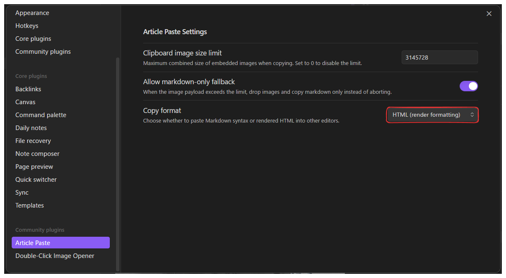

# Article Paste

An Obsidian plugin that copies the current selection as web-ready article content, including inline images embedded directly in the clipboard.

## Features

- Copy the current selection (or entire note when nothing is selected) into the clipboard with Markdown and HTML representations
- Resolve wiki-style and Markdown image embeds into base64 data URIs so browsers paste inline images without manual uploads
- Guard against oversized clipboard payloads with configurable limits and optional markdown-only fallback when images are too large
- Aggregate success and warning notices so you immediately see missing files, unsupported embeds, or skipped images
- Choose between rendered HTML output or escaped Markdown when pasting into external editors

## How to Use

1. Install and enable the plugin in Obsidian settings
2. Open a note and select the content you want to publish
3. Run the `Copy selection as article` command or use the editor context menu entry
4. Paste into your web article editor; the clipboard carries HTML, Markdown, and image data

## Example: Pasting into Microsoft Word

1. Open **Settings -> Community plugins -> Article Paste -> Settings** and set **Copy format** to **HTML**.
   
2. Copy the desired selection and paste it into Microsoft Word.
   

## Installation

### From Obsidian Community Plugins

1. Open **Settings -> Community plugins**
2. Select **Browse**, search for "Article Paste"
3. Install and enable the plugin

### Manual Installation

1. Build the plugin with `npm run build`
2. Copy the generated `main.js`, `manifest.json`, and optional `styles.css` to `.obsidian/plugins/obsidian-article-paste/`
3. Reload Obsidian and enable the plugin

## Settings

- **Clipboard image size limit**: Maximum combined size of embedded images (set to `0` to disable). Warnings appear when the payload exceeds this limit
- **Allow markdown-only fallback**: When enabled, the plugin drops images and copies Markdown if the payload is too large instead of aborting
- **Copy format**: Decide whether the clipboard should favour rendered HTML or escaped Markdown blocks when pasting

Access via **Settings -> Community plugins -> Article Paste -> Settings**.

## Troubleshooting

**Images are missing after paste?**
- Confirm the referenced files exist inside the vault and are supported image formats (PNG, JPG, GIF, WebP, SVG, BMP, TIFF)
- Check the notice for warnings about missing files, unsupported embeds, or skipped external URLs
- Increase the clipboard size limit or enable markdown-only fallback if large images are skipped

**Nothing copies?**
- Ensure text is selected or the active pane contains a note when invoking the command
- Review warnings about clipboard size or encoding errors in the notice banner

## Development

- `npm install` - install dependencies
- `npm run dev` - compile in watch mode
- `npm run build` - run type checks and produce `main.js`
- `npm run test` - execute unit tests (Vitest)

## License

MIT License - see [`LICENSE`](LICENSE).
